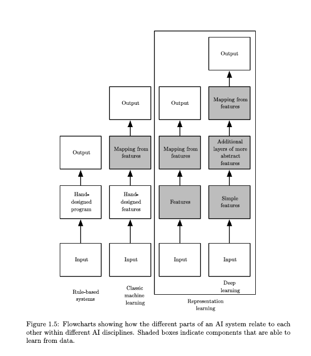
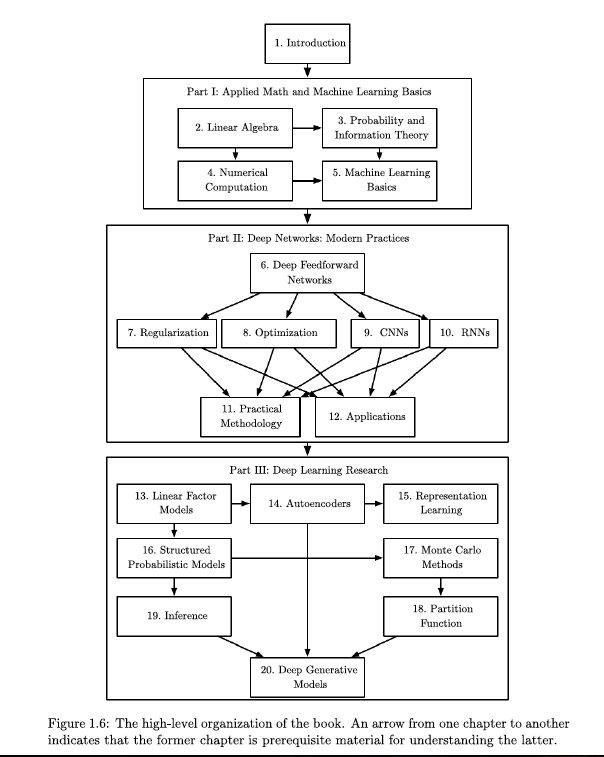
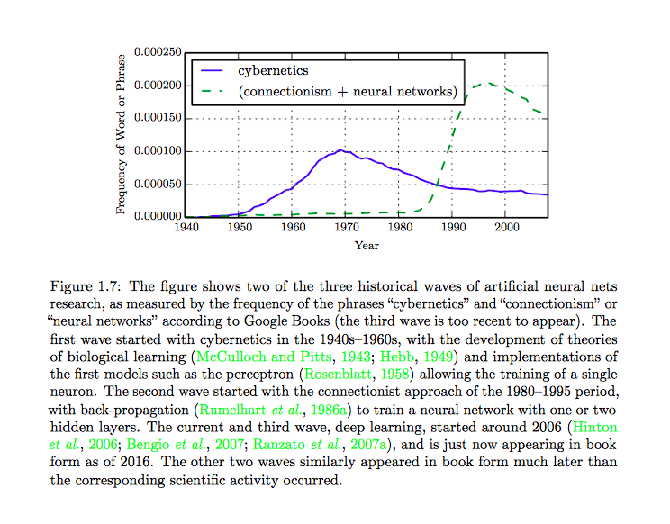
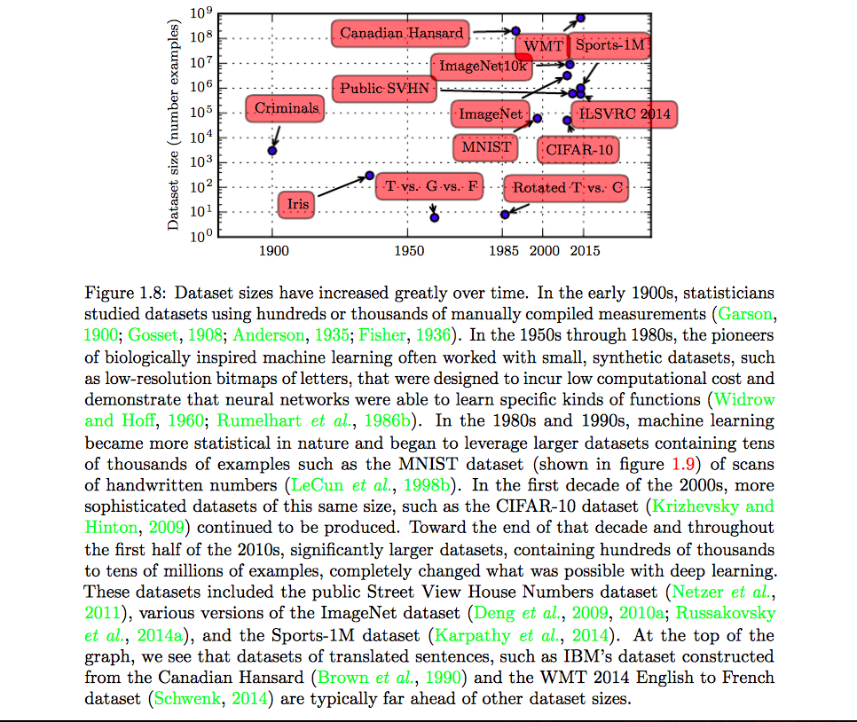
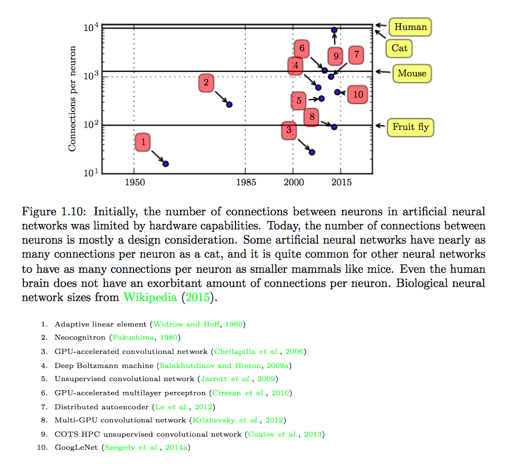
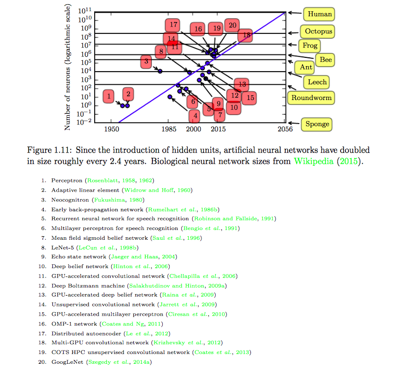

# Introduction

- Use machine learning to discover not onlythe mapping from representation to output but also the representation itself. This approach is known asrepresentation learning.
- When designing features or algorithms for learning features, our goal is usually to separate thefactors of variation that explain the observed data. They can be thought of as concepts or abstractions that help us make sense of the rich variability in the data.When analyzing a speech recording, the factors of variation include the speaker’sage, their sex, their accent and the words that they are speaking.
- Learning or evaluating this mapping seems insurmountable if tackled directly. Deep learning resolves this difficulty by breaking the desired complicated mapping into a series of nested simple mappings, each described by a different layer of the model. The input is presented at the visible layer, so named because it contains the variables that we are able to observe. Then a series of hidden layers extracts increasingly abstract features from the image. These layers are called “hidden” because their values are not given in the data; instead the model must determine which concepts are useful for explaining the relationships in the observed data.
- Depth of probabilistic modeling graph can be measured in two ways:
	- Depth of computational graph (mathematical operations)
	- Depth of concept graph (each node is a concept)
- Deep learning is a particular kind of machine learning that achieves great power and flexibility by learning to represent the world as a nested hierarchy of concepts, with each concept defined in relation to simpler concepts, and more abstract representations computed in terms of less abstract ones.
- Various AI approaches :
	- 
- Concept Map :
	- 
- Phases of Deep Learning:
	- 
- The main reason for the diminished role of neuroscience in deep learning research today is that we simply do not have enough information about the brain to use it as a guide.
- The central idea in connectionism is that a large number of simple computational units can achieve intelligent behavior when networked together. This insight applies equally to neurons in biological nervous systems and to hidden units in computational models.
- During the late 90s and early 2000 when neural networks were phasing out, the Canadian Institute for Advanced Research (CIFAR) helped to keep neural networks research alive via its Neural Computation and Adaptive Perception (NCAP) research initiative. This program united machine learning research groups led by Geoffrey Hinton at University of Toronto, Yoshua Bengio at University of Montreal, and Yann LeCun at New York University. The CIFAR NCAP research initiative had a multi-disciplinary nature that also included neuroscientists and experts in human and computer vision.
- Increasing Datasets Sizes:
	- 
- As of 2016, a rough rule of thumb is that a supervised deep learning algorithm will generally achieve acceptable performance with around 5,000 labeled examples per category, and will match or exceed human performance when trained with a dataset containing at least 10 million labeled examples.
- Number of connections of neurons:
	- 
- Deep learning has also made contributions back to other sciences. Modern convolutional networks for object recognition provide a model of visual processing that neuroscientists can study (DiCarlo, 2013). It has been successfully used to predict how molecules will interact in order to help pharmaceutical companies design new drugs (Dahl et al., 2014),to search for subatomic particles (Baldi et al., 2014), and to automatically parse microscope images used to construct a 3-D map of the human brain (Knowles-Barley et al., 2014).
- Increasing Model Sizes:
	- 
