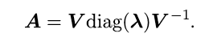
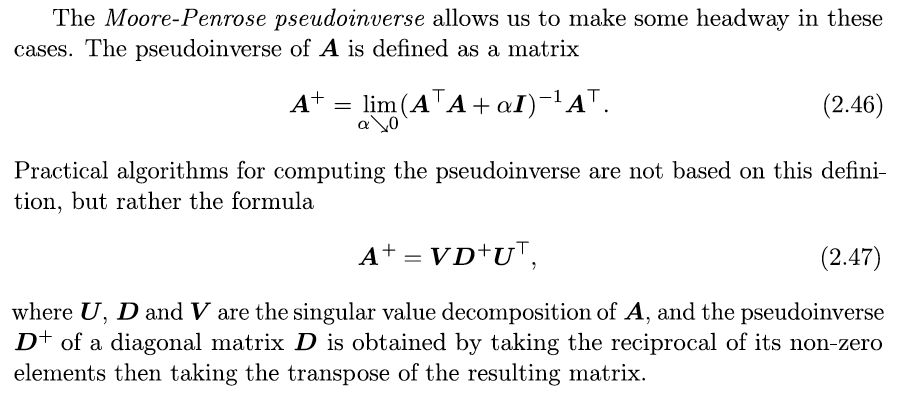
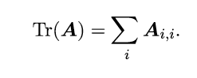
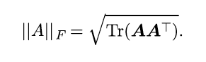

# Linear Algebra

- Scalars: A scalar is just a single number, in contrast to most of the other objects studied in linear algebra, which are usually arrays of multiple numbers. We write scalars in italics. We usually give scalars lower-case variable names. When we introduce them, we specify what kind of number they are. For example, we might say “Let s ∈ R be the slope of the line,” while defining a real-valued scalar, or “Let n ∈ N be the number of units,” while defining a natural number scalar.
- Vectors: A vector is an array of numbers. The numbers are arranged in order. We can identify each individual number by its index in that ordering. Typically we give vectors lower case names written in bold typeface, such as x. The elements of the vector are identified by writing its name in italic typeface, with a subscript. The first element of x is x_1 and so on. x_−k is the vector containing all elements of x except for x_k.
- Matrices: 2-D array of numbers.
- Tensors: Arrays with more than 2 axes.
- When a smaller array or scalar is added to a matrix, the implicit copying of the smaller component is known as broadcasting.
- Multiplying matrices
	- C = A \* B, A = m\*n, B = n\*p, C = m\*p
	- C = AoB , element-wise product, Hadamard product
	- C = A.B, dot product
- Formally, this kind of redundancy is known as linear dependence. A set of vectors is linearly independent if no vector in the set is a linear combination of the other vectors.
- Norm is used to measure the size of the vector.
- Computation with diagonal matrices is very efficient.
- Symmetric matrix, A = A_T
- Orthogonal x_T \* y = 0, orthonormal if unit norm, unit norm is when ||x||_2 = 1
- An orthogonal matrixis a square matrix whose rows are mutually orthonormal and whose columns are mutually orthonormal:
- Eigendecomposition - Decomposing a matrix into a set of eigenvectors (**V**)and eigenvalues (**Lambda**).
	- 
- While any real symmetric matrix **A** is guaranteed to have an eigendecomposition, the eigendecomposition may not be unique. If any two or more eigenvectors share the same eigenvalue, then any set of orthogonal vectors lying in their span are also eigenvectors with that eigenvalue, and we could equivalently choose a **Q** using those eigenvectors instead. By convention, we usually sort the entries of **Λ** in descending order. Under this convention, the eigendecomposition is unique only if all of the eigenvalues are unique.
- [Singular Value Decomposition](https://en.wikipedia.org/wiki/Singular_value_decomposition) is used to calculate [Moore-Penrose Pseudoinverse](https://en.wikipedia.org/wiki/Moore%E2%80%93Penrose_pseudoinverse)
    + 
- Trace operator is used in operations that cannot be described without resorting to summation. E.g. Frobenius norm of a matrix
    + 
    + 
- Determinant of a square matrix is equal to the product of all the eigenvalues.
- The absolute value of the determinant can be thought of as a measure of how much multiplication by the matrix expands or contracts space. If the determinant is 0, then space is contracted completely along at least one dimension, causing it to lose all of its volume. If the determinant is 1, then the transformation preserves volume
- For more information on eigendecomposition look [here](https://www.utdallas.edu/~herve/Abdi-EVD2007-pretty.pdf)
