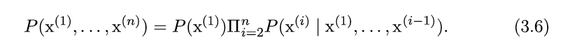

# Probability and Information Theory

- This chapter gives intuition into why and how probability is used and covers some basic concepts of probability
- To know more in depth on how uncertainty can be quantified using probability, [this book](http://dl.acm.org/citation.cfm?id=52121) is recommended.
- Three sources of uncertainty
    + Inherent stochasticity in the system being modeled
    + Incomplete observability
    + Incomplete modeling - When model discards some of the information we have observed.
- **Random Variable** - Variable that can take on different values randomly.
- **Probability Distributions** - Description of how likely a random variable or set of random variables is to take on each of its possible states.
- **Marginal Probability** - Probability distribution over the subset.
- **Conditional Probability** - Probability of some event, given the other event has happened.
- Computing the consequences of an action is called making an *intervention query*. It belongs to domain of *causal modeling*.
- **Chain Rule** of conditional probabilities
    + 